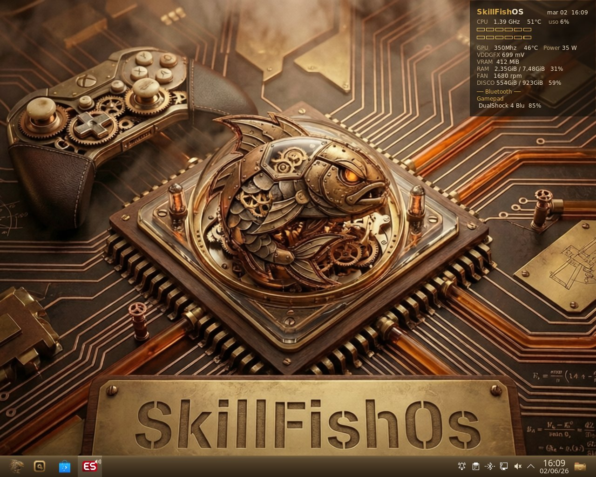
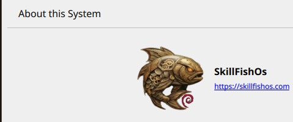
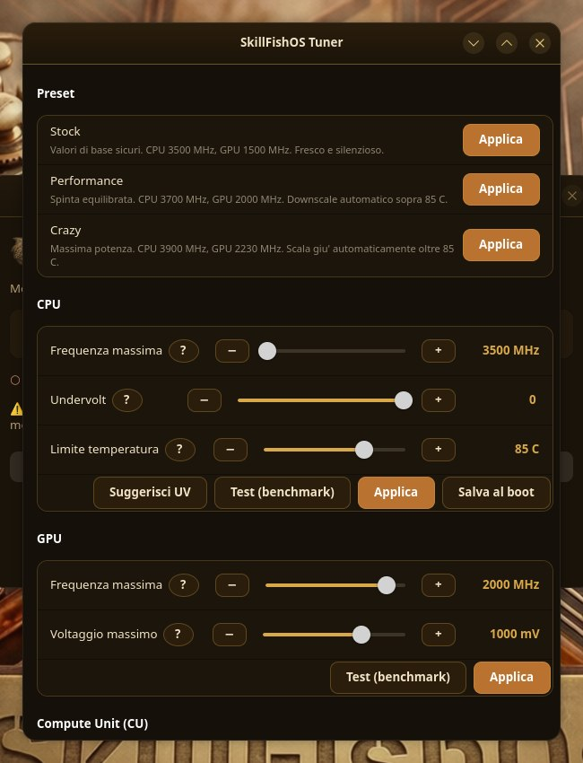
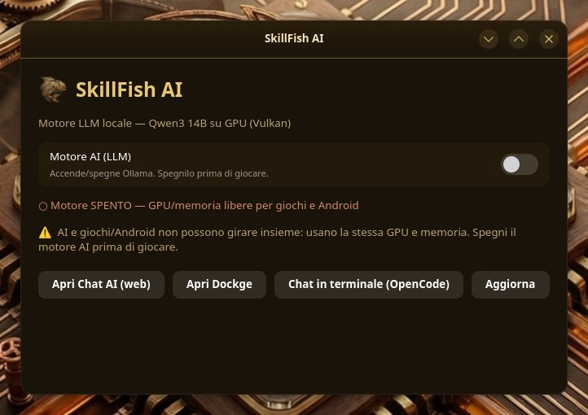
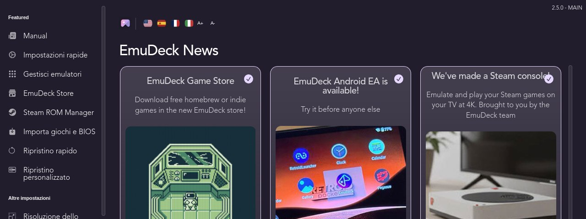

<div align="center">

# SkillFishOS

**A dark, steampunk, gaming‑focused Linux distribution that turns the AMD BC‑250 compute board into a daily‑drivable desktop and games console — tuned and ready out of the box.**

[**skillfishos.com**](https://skillfishos.com) · Based on Debian · KDE Plasma · GPL‑3.0

**Release 26.06 "Aetherium"** — BC‑250 edition · boots in English, language chosen at install · a generic x86‑64 build will follow



</div>

---

SkillFishOS takes the cheap, abundant **AMD BC‑250** compute board — a semi‑custom APU from the **AMD Zen 2 + RDNA 2** family (CPU codename *Oberon*, GPU *Cyan Skillfish* / `GFX1013`, 16 GB GDDR6) — and makes it a proper Linux machine: a steampunk KDE Plasma desktop on one side, a Steam Big‑Picture / EmuDeck games console on the other, with all of the board's awkward hardware **tamed and tuned for you**.

> It began as a way to get kids to **use and learn Linux while they game** — gaming is the carrot, Btrfs snapshots are the safety net that lets them tinker without fear.

**The whole point: a ready‑to‑use system, no tinkering required.** Every governor, kernel patch, overclock profile, thermal guard and driver workaround is already configured and tested — you turn it on and it runs at full speed. Everything is documented here so the community can understand it, reproduce it, and make it better.

> 🤝 **This is a community open‑source project and we want it to grow.** Contributions of every kind are welcome — see [CONTRIBUTING.md](CONTRIBUTING.md).

---

## Hardware target

| | |
|---|---|
| Board | AMD BC‑250 (*Cyan Skillfish*, `GFX1013`) |
| CPU | AMD Zen 2 (*Oberon*), 6 cores active — OC to **3.9 GHz** (Turbo), **4.0 GHz** validated |
| GPU | RDNA 2, 24 CUs default → **40 CUs unlockable** |
| Memory | 16 GB GDDR6 (shared / UMA) |
| Base distro | Debian **sid** |

The BC‑250 is fantastic value but a difficult target: non‑standard clock control through the SMU, a broken display IRQ/HPD path, an unreliable RDSEED, locked‑down compute units, no IOMMU and BIOS ACPI gaps. SkillFishOS papers over all of it. See **[docs/OPTIMIZATIONS.md](docs/OPTIMIZATIONS.md)** for the full list and how each problem is solved.

---

## Highlights

- 🐧 **Custom `linux-tkg` kernel** `7.0.10-skillfishos` — BORE scheduler, GCC `-O3`, `-march=znver2`, 1000 Hz, NTsync + fsync, with BC‑250 patches: GPU clock range unlocked **350–2230 MHz**, **40‑CU unlock** (opt‑in), and the cosmetic *"RDSEED is not reliable…"* boot spam silenced. Prebuilt `.deb` in [**Releases**](../../releases) — see [docs/BUILD.md](docs/BUILD.md).
- ⚡ **Real clock control** — the `cyan-skillfish-governor` drives the GPU to its safe‑point and idles it at 350 MHz; an SMU **CPU overclock & undervolt** reaches **4.0 GHz** (validated) under an 85 °C thermal guard. **~11,330 GFLOPS** fp32 with the 40‑CU unlock (≈1.8× a stock build). The ISO ships the safe **Stock** profile; users opt into more from the Tuner.
- 🎛️ **SkillFishOS Tuner** — a native **PyQt6** app to overclock & undervolt CPU and GPU, control the fan, resize the UMA VRAM split, and toggle the 40‑CU unlock, with **four ready presets** (Stock · Performance · Turbo · Crazy) and built‑in *benchmark‑and‑rollback* testing. Bilingual **IT/EN**. No terminal needed.
- 📊 **Live system HUD** — a translucent overlay with per‑core CPU load, clocks, temps, power draw, VRAM/RAM, fan RPM and Bluetooth controller battery, all from real sensors.
- 📸 **Btrfs + Snapper + grub‑btrfs** — automatic pre/post‑apt snapshots and bootable rollbacks straight from the GRUB menu, with `@home` kept separate so a rollback never touches user data.
- 🎮 **Gaming, ready** — Steam, Heroic, Proton, gamescope (+ FSR 1), GameMode, MangoHud, plus **EmuDeck** and the **ES‑DE** frontend to install and configure emulators in a few clicks. *(SkillFishOS ships the tools, not the games — you bring your own games and ROMs.)*
- 🧠 **On‑device AI** — an Ollama + OpenWebUI stack accelerated in **Vulkan** on the integrated GPU, with a one‑click panel that frees the GPU when you want to play.
- 🎨 **End‑to‑end steampunk theme** — GRUB, Plymouth, SDDM, the KDE Plasma desktop, icons, cursors, Kvantum and wallpaper. The theme lives in [`theme/`](theme/).
- 🖨️ Driverless printing (CUPS + IPP Everywhere + Avahi), Bluetooth controllers, broken‑HPD display hot‑swap, and a fully localized desktop.

---

## Screenshots

| About this system | SkillFishOS Tuner |
|---|---|
|  |  |

| Local AI panel | EmuDeck — easy emulation |
|---|---|
|  |  |

---

## Performance

`vkpeak` fp32‑scalar throughput (GFLOPS):

| Configuration | GFLOPS | Notes |
|---|---:|---|
| Stock ~2000 MHz, 24 CU | 6141 | baseline |
| tkg + governor, 24 CU | 6868 | +12 % |
| **tkg + governor + 40‑CU unlock** | **11329** | **≈1.84× baseline** |

CPU OC validated up to **4.0 GHz** (~1224 mV, 120 s stress, 83 °C peak) on the reference board; under combined CPU+GPU load the APU shares its power budget gracefully, easing CPU clocks to stay within the 85 °C limit. Full methodology and benchmarks: [docs/OPTIMIZATIONS.md](docs/OPTIMIZATIONS.md).

---

## Get it

### Prebuilt kernel

A prebuilt kernel `.deb` is published under [**Releases**](../../releases/tag/kernel-7.0.10-skillfishos):

```sh
sudo dpkg -i linux-image-7.0.10-skillfishos_7.0.10-1_amd64.deb \
            linux-headers-7.0.10-skillfishos_7.0.10-1_amd64.deb
sudo apt-mark hold linux-image-7.0.10-skillfishos linux-headers-7.0.10-skillfishos
```

To build it yourself, see [docs/BUILD.md](docs/BUILD.md) and [`kernel-build/`](kernel-build/).

### Installable ISO — **26.06 "Aetherium"**

The installable live ISO (`SkillFishOS-26.06-Aetherium-BC250-amd64.iso`, ~5.6 GB) is captured from the real system with [penguins‑eggs](https://github.com/pieroproietti/penguins-eggs): KDE Plasma steampunk desktop, Btrfs + Snapper + grub‑btrfs, the **Calamares** installer. It **boots in English** and lets you pick your **language and keyboard** at install; the bilingual apps and HUD follow the chosen locale.

The project is on **SourceForge** too: [sourceforge.net/projects/skillfishos](https://sourceforge.net/projects/skillfishos/) (code mirror, blog, forum, wiki). The publishing flow (ISO hosting on SourceForge Files, the **`aetherium`** APT update repository, and the DistroWatch submission) is documented under [`distribution/`](distribution/).

> The signed **APT repo is live** at <https://mtsistemi.github.io/SkillFishOS/> (`apt install skillfishos-kernel`). The ISO download link goes live with the SourceForge Files upload — track progress on [skillfishos.com](https://skillfishos.com).

---

## Repository layout

```
README.md          this file
LICENSE            GPL-3.0
CONTRIBUTING.md    how to get involved
docs/              full documentation
  OPTIMIZATIONS.md   kernel patches, governor, OC/UV, 40-CU, VRAM/GTT, audio/display, controllers
  DESKTOP.md         KDE Plasma, steampunk theme, HUD, Tuner, AI panel
  GAMING.md          Steam, EmuDeck, ES-DE, emulators (bring your own games)
  AI.md              the local Ollama + OpenWebUI Vulkan stack
  BUILD.md           building the kernel and the ISO
kernel-build/      linux-tkg recipe (customization.cfg + BC-250 userpatches)
theme/             the "SkillFish Steampunk" theme (icons, cursors, Kvantum, wallpapers, palettes)
distribution/      release & publishing: APT repo (suite aetherium), SourceForge, DistroWatch
iso/               live-build configuration for the installable ISO
scripts/           helper scripts (e.g. publish-kernel.sh)
screenshots/       images used in this README
legacy/            superseded early setup scripts, kept for reference
```

---

## Documentation

Everything that makes the BC‑250 sing is documented:

- **[docs/OPTIMIZATIONS.md](docs/OPTIMIZATIONS.md)** — the heart of the project: the kernel patches, SMU governor, CPU/GPU overclock & undervolt, 40‑CU unlock, VRAM/GTT tuning, broken‑HPD display fix, audio, Wi‑Fi/Bluetooth and controllers.
- **[docs/DESKTOP.md](docs/DESKTOP.md)** — KDE Plasma, the steampunk theme, the live HUD, the Tuner and the AI panel.
- **[docs/GAMING.md](docs/GAMING.md)** — the gaming stack and how EmuDeck / ES‑DE are set up.
- **[docs/AI.md](docs/AI.md)** — running LLMs locally on the integrated GPU via Vulkan.
- **[docs/BUILD.md](docs/BUILD.md)** — build the kernel and the ISO from source.

---

## Contributing

We genuinely want this project to take off, and that needs people. Whether you can write kernel patches, package software, improve the theme, test on real hardware, fix typos in the docs, or just file good bug reports — **you're welcome here**. Start with [CONTRIBUTING.md](CONTRIBUTING.md), open an issue, or say hi in a discussion.

---

## Status

Work in progress, dogfooded daily on real BC‑250 hardware. An independent community project — **not affiliated with AMD or any other vendor.**

## Credits & references

Built on the shoulders of:

- [Frogging‑Family/linux‑tkg](https://github.com/Frogging-Family/linux-tkg) — the kernel build system
- [Magnap/cyan‑skillfish‑governor](https://github.com/Magnap/cyan-skillfish-governor) — GPU SMU clock control
- [bc250‑collective/bc250_smu_oc](https://github.com/bc250-collective/bc250_smu_oc) · [fanoush/bc250_memcfg](https://github.com/fanoush/bc250_memcfg) · [duggasco/bc250‑40cu‑unlock](https://github.com/duggasco/bc250-40cu-unlock)
- [EmuDeck](https://www.emudeck.com/) · [ES‑DE](https://es-de.org/) · [Ollama](https://ollama.com/)
- BC‑250 community docs: [bc250.info](https://bc250.info) · [elektricm.github.io/amd-bc250-docs](https://elektricm.github.io/amd-bc250-docs) · [mothenjoyer69/bc250-documentation](https://github.com/mothenjoyer69/bc250-documentation)

## License

[GPL‑3.0](LICENSE). The bundled artwork/theme is provided for use with SkillFishOS.
