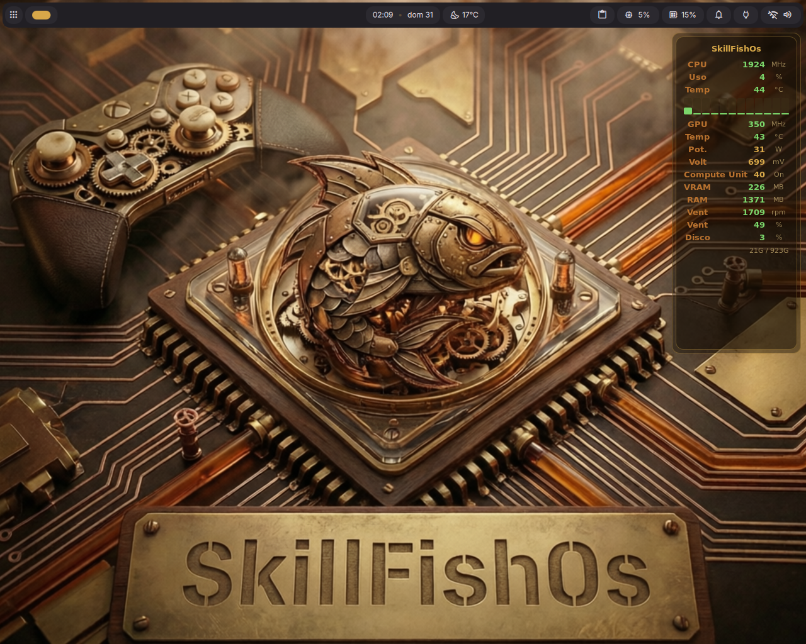
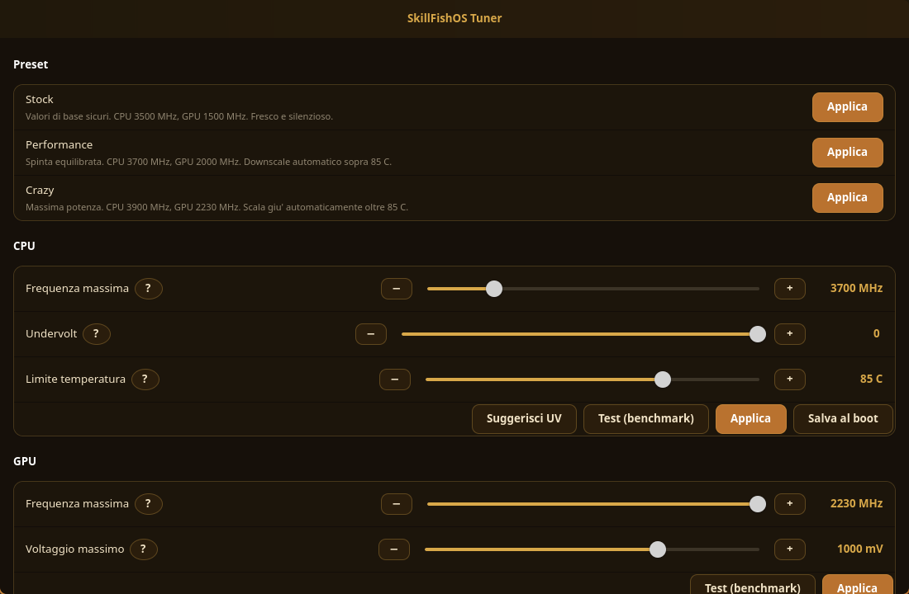
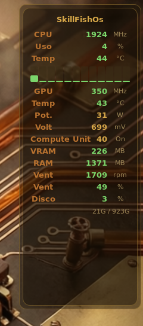

# SkillFishOS

**A dark, gaming‑focused Linux distribution for the AMD BC‑250 ("Cyan Skillfish") mining board, reborn as a desktop & console.**



SkillFishOS turns the cheap, abundant **AMD BC‑250** compute board (the same PS5‑class APU: Zen 2 + RDNA 2, 16 GB GDDR6) into a proper, daily‑drivable Linux machine: a steampunk "Brass Clockwork" Hyprland desktop on one side, a Steam Big‑Picture gaming console on the other, with all of the board's quirky hardware tamed and tuned out of the box.

> It started as a way to get kids to *use and learn Linux while they game* — gaming is the carrot, Btrfs snapshots are the safety net that lets them tinker without fear.

---

## Hardware target

| | |
|---|---|
| Board | AMD BC‑250 ("Cyan Skillfish", `GFX1013`) |
| CPU | AMD Zen 2, 6 cores active |
| GPU | RDNA 2, 24 CUs (40 CUs unlockable) |
| Memory | 16 GB GDDR6 (shared / UMA) |
| Base distro | Debian **sid** |

The BC‑250 is a fantastic value but a difficult target: non‑standard clock control via the SMU, a broken display IRQ/HPD path, an unreliable RDSEED, locked‑down CUs, no IOMMU, and BIOS ACPI gaps. SkillFishOS papers over all of it.

---

## Highlights

- 🐧 **Custom `linux-tkg` 7.0.10 kernel** (`7.0.10-skillfishos`) — BORE scheduler, GCC `-O3`, `-march=znver2`, 1000 Hz, NTsync + fsync, with BC‑250 patches baked in:
  - GPU SCLK range unlocked **350 – 2230 MHz** (was 1000–2000).
  - **40‑CU unlock** (opt‑in via `amdgpu.bc250_cc_write_mode=3`).
  - The cosmetic per‑CPU *"RDSEED is not reliable…"* boot spam silenced (RDSEED still correctly disabled, just quietly).
- ⚡ **Real clock control** — the [cyan‑skillfish‑governor](https://github.com/Magnap/cyan-skillfish-governor) drives the GPU to **2230 MHz** under load and idles it at 350 MHz; a persistent SMU **CPU overclock** holds **3700 MHz** with a thermal guard.
- 🎛️ **SkillFishOS Tuner** — a native GTK4 / libadwaita app to overclock/undervolt CPU & GPU, control the fan, resize VRAM (UMA), and toggle the 40‑CU unlock, each with built‑in benchmark‑and‑rollback testing.
- 📊 **Live HUD** — a translucent `eww` overlay with per‑core CPU load, clocks, temps, power, VRAM/RAM and fan, all from real sensors.
- 📸 **Btrfs + Snapper + grub‑btrfs** — automatic pre/post‑apt snapshots and bootable rollbacks from the GRUB menu, with `@home` kept separate so rollbacks never touch user data.
- 🎮 **Gaming stack** — Steam, Heroic, gamescope (+ FSR 1), GameMode, MangoHud, EmuDeck and emulators, plus a dedicated gamescope "console" session.
- 🎨 **"Brass Clockwork" theme** end‑to‑end — GRUB, Plymouth, SDDM, the Hyprland/DMS desktop and wallpaper.
- 🖨️ **Driverless printing** (CUPS + IPP Everywhere + Avahi), Bluetooth, and a fully localized desktop.

---

## Screenshots

| SkillFishOS Tuner | System HUD |
|---|---|
|  |  |

---

## Performance

`vkpeak` fp32‑scalar throughput (GFLOPS):

| Configuration | GFLOPS | Notes |
|---|---:|---|
| Stock XanMod ~2000 MHz, 24 CU | 6141 | baseline |
| tkg + governor 2230 MHz, 24 CU | 6868 | +12 % |
| **tkg + governor + 40‑CU unlock** | **11329** | **1.84× baseline** |

CPU OC validated stable at **3700 MHz** under sustained load; the APU shares its power budget gracefully, easing CPU clocks under combined CPU+GPU load to stay within thermal limits.

---

## Under the hood

- **Desktop:** Hyprland + [DankMaterialShell](https://github.com/AvengeMedia/DankMaterialShell) (quickshell) on a custom brass theme · SDDM display manager.
- **Filesystem:** Btrfs (`@rootfs` + `@home`), Snapper timeline + apt hooks, grub‑btrfs for snapshot boot entries.
- **Power/thermal:** `cyan-skillfish-governor` (GPU SMU), `bc250_smu_oc` (CPU SMU OC/UV), a thermal‑guard watchdog, and `nct6687` fan/sensor support.
- **Tools shipped:** SkillFishOS Tuner, the eww HUD + metrics scripts, `amdgpu_top`, `bc250_memcfg` (VRAM/UMA sizing via CMOS).

---

## Repository layout

```
config/         live-build configuration for the installable ISO
auto/           live-build auto scripts
kernel-build/   linux-tkg recipe (customization.cfg + BC-250 userpatches)  ← see kernel-build/README.md
scripts/        helpers (e.g. publish-kernel.sh)
build.sh        ISO build entry point
screenshots/    images used in this README
```

The installable ISO reproduces the system described above (Hyprland+DMS desktop, gamescope session, Btrfs + Snapper + grub‑btrfs, Calamares installer).

### Kernel

A prebuilt kernel `.deb` is published under [**Releases**](../../releases/tag/kernel-7.0.10-skillfishos) (`kernel-7.0.10-skillfishos`):

```sh
sudo dpkg -i linux-image-7.0.10-skillfishos_7.0.10-1_amd64.deb \
            linux-headers-7.0.10-skillfishos_7.0.10-1_amd64.deb
sudo apt-mark hold linux-image-7.0.10-skillfishos linux-headers-7.0.10-skillfishos
```

To build it yourself, see [`kernel-build/README.md`](kernel-build/README.md). In short: clone [linux‑tkg](https://github.com/Frogging-Family/linux-tkg), drop in `customization.cfg` and the three `userpatches/*.mypatch`, patch `install.sh` to drop the `tkg-` flavor prefix, and run `./install.sh install`.

---

## Status

Work in progress, dogfooded directly on real BC‑250 hardware. Not affiliated with AMD. "PlayStation" and "PS5" are trademarks of Sony Interactive Entertainment; SkillFishOS is an independent community project.

## Credits & references

- [Frogging‑Family/linux‑tkg](https://github.com/Frogging-Family/linux-tkg)
- [Magnap/cyan‑skillfish‑governor](https://github.com/Magnap/cyan-skillfish-governor)
- [bc250‑collective/bc250_smu_oc](https://github.com/bc250-collective/bc250_smu_oc) · [fanoush/bc250_memcfg](https://github.com/fanoush/bc250_memcfg) · [duggasco/bc250‑40cu‑unlock](https://github.com/duggasco/bc250-40cu-unlock)
- [AvengeMedia/DankMaterialShell](https://github.com/AvengeMedia/DankMaterialShell)
- BC‑250 community docs: [bc250.info](https://bc250.info) · [elektricm.github.io/amd-bc-250-docs](https://elektricm.github.io/amd-bc-250-docs)
